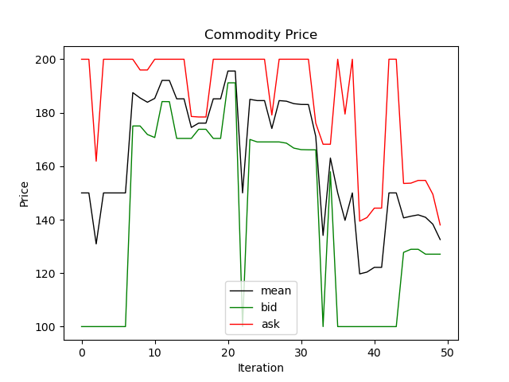
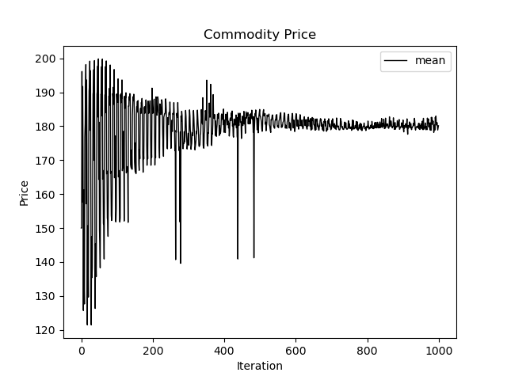
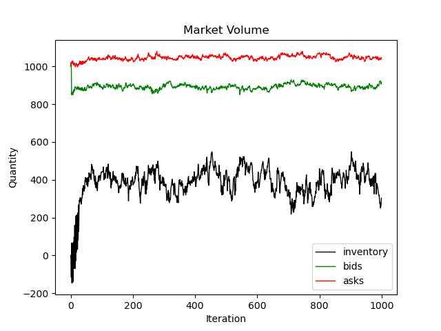
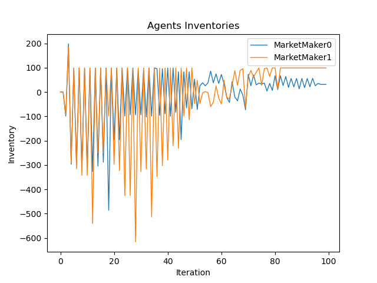

# AgentBasedSimulation
## Agent Based Simulation for the HSE Course Work "Liquidity Forecasting"

The outline for this project is the following:
1. **agents.py** - contains defenitions for agents: NoiseTrader, MarketMaker, ExchangeAgent; set the logic of their interactions
2. **simulator.py** - responsible for setting up the simulation; it containts a single class Simulator, which writes down all necessary information for diagnostic
of the simulation, remembers all states of market spread and distributes lagged infromtaion among traders (currently state of the market spread); it also
plot all relevant research analytics.
3. **main.py**  initializaes all traders, initialize market and Simulator class object, runs simulation, plot diagnostic plot and if needed you can access attributes
of all classes in this file.
   
### Configure Simulation

```Python
from agents import ExchangeAgent, NoiseAgent, MarketMaker
from simulator import Simulator

spread_initial = {'bid': 100, 'ask': 200}

# Initialize Exchange Agent
exchange = ExchangeAgent(spread_initial, depth=1000)

# Initialize Traders
noise_agents = [NoiseAgent(exchange) for i in range(100)]
market_makers = [MarketMaker(exchange, 0, 100, -100)]

# Simulation
simulator = Simulator(exchange, noise_agents=noise_agents,
                      market_makers=market_makers).fit(1000, nt_lag=2, mm_lag=2)
```

### Plot prices





### Analyze Order Book


### Investigate Market Makers inventory

